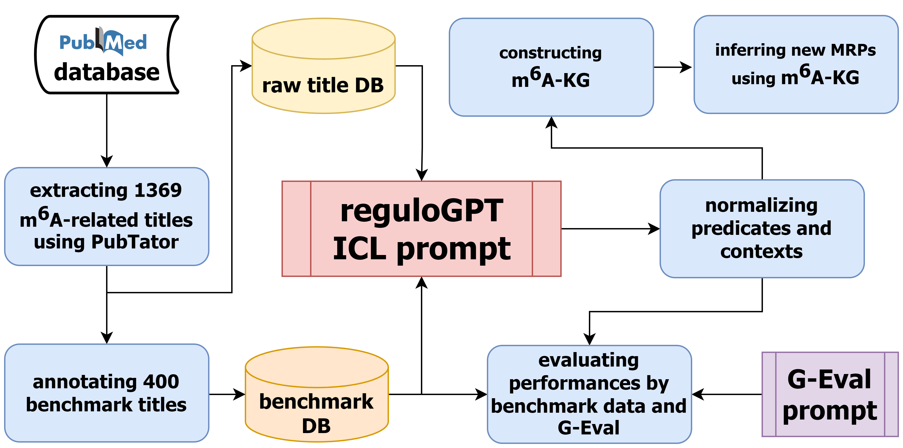
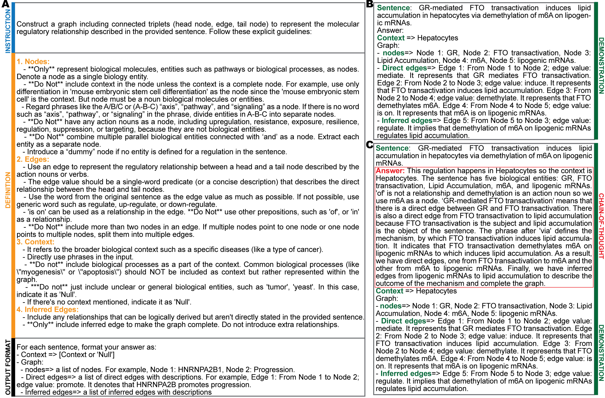
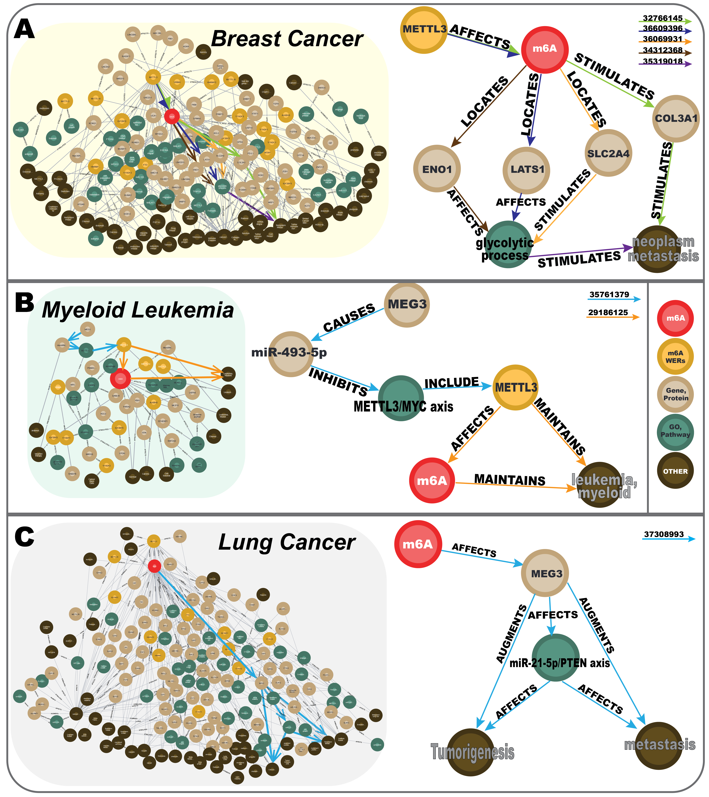
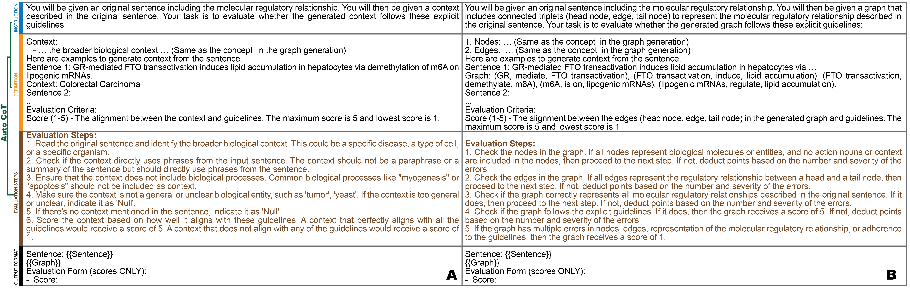

# reguloGPT: End-to-End Knowledge Graph creation

Molecular Regulatory Pathways (MRPs) are key to understanding biological functions. Knowledge Graphs (KGs) help organize and analyze MRPs by structuring complex interactions. Current methods for extracting KGs from biomedical literature struggle with hierarchical relationships and context. Large Language Models (LLMs) like GPT-4 show promise in addressing these issues but remain underexplored for end-to-end KG construction. We present reguloGPT, a novel GPT-4 based in-context learning prompt designed for the end-to-end extraction of a regulatory graph and context from a sentence that describes regulatory interactions. reguloGPT employs a context-aware relational graph to capture MRPs’ hierarchical structure and resolves semantic inconsistencies by embedding context directly within the relational edges. We created a benchmark dataset comprising four hundred annotated PubMed titles on N6-methyladenosine (m6A) regulations. Rigorous evaluations of reguloGPT on the benchmark dataset showed marked improvements over existing algorithms and other LLMs. We further developed a novel G-Eval scheme, leveraging GPT-4 for annotation-free performance evaluation that demonstrated agreement with evaluations on the benchmark dataset. Lastly, we constructed m6A-KG by applying reguloGPT to 1,396 m6Arelated
titles and demonstrated its utility in elucidating m6A’s regulatory mechanisms of cancer phenotypes across various cancers. These results underscore reguloGPT’s potential for advancing biological knowledge extraction.

## Overall Process

The overall process of developing reguloGPT involves collecting data, creating a benchmark dataset, engineering ICL reguloGPT prompt, evaluating performance, generating a context-aware m6A-KG, and utilizing m6A-KG in downstream analysis.

## reguloGPT ICL Prompts

reguloGPT prompts: (A) Baseline prompt including instruction, definition, and output format. (B) Demonstration in few-shot prompt. (C) Demonstration in CoT prompt.

## m6A-KG

Cancer-type specific KG of (A) Breast cancer, (B) Myeloidleukemia, and (C) Lung cancer. Extracted pathways are shown to the left. Edge colors are associated with the supporting titles.

## G-Eval Prompt

(A) context evaluation and (B) graph evaluation. The Evaluation Steps were generated by GPT-4 based on our Instructions and Definitions. Then, they evaluate the context or graph added in the Output Format in a form-filling fashion.

